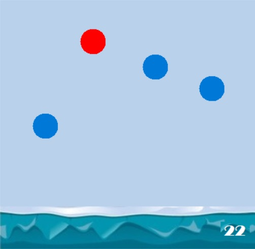
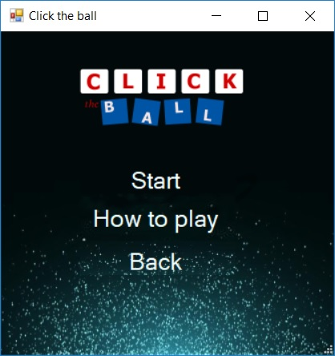
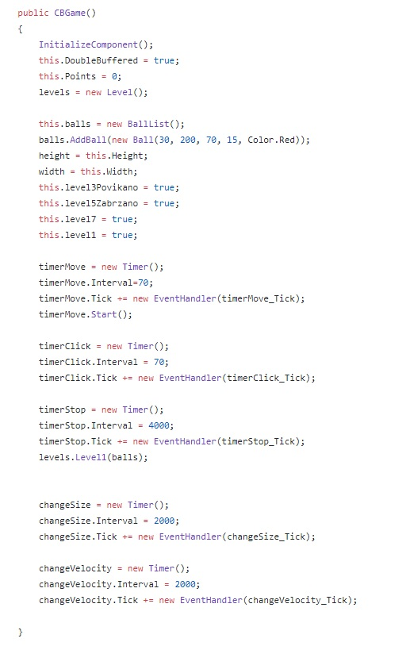
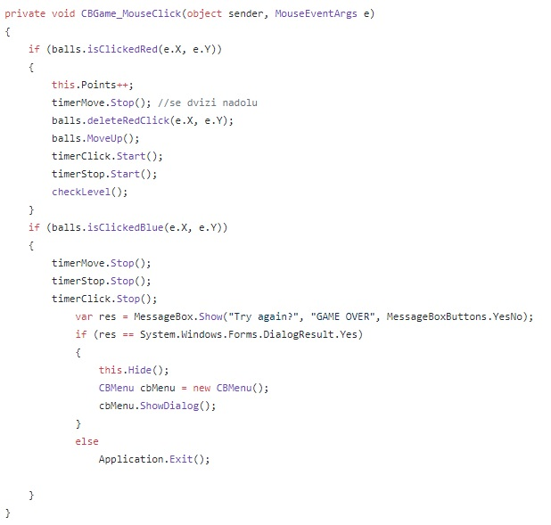

# Click-the-Ball Elena Naunova 161015, Ivona Efremova 161020
Опис на апликацијата:
Пробавме да создадеме едноставна, но заразна игра во која целта е успешно да го кликнеш црвеното топче без да падне во водата, 
притоа избегнувајќи ја секоја препрека успешно.

Правила на играта:

•	Играта има 7 нивоа, целата е успешно да стигнете до последното.

•	Доколку натиснете на плаво топче играта завршува.

•	Доколку не се кликне на црвеното топче извесно време тоа започнува да паѓа надолу.

•	Црвеното топче не смее да падне во водата.

•	Секое ниво носи различен предизвик.

На почениот прозорец има опции за започнување на нова игра, упатство за играње и опција за излегување од апликацијата.

При кликнување за нова игра се отвора нов прозорец со што играта започнува. Доколку за одредено ниво има воведено нешто ново се појавува 
Message Box, за во случај корисникот да го нема прочитано упатството за играње.
Претставување на проблемот:

CBGame

Главните податоци и функции се запишани во public class CBGame.
 Во оваа класа променливи кои се јавуваат се Timer-ите со чија помош ги придвижуваме топчињата и во соодветните нивоа го менуваме 
 радиусот или брзината на топчето. И променливата points според која го одредуваме level-от на играта.
 
 
 
 При секој клик на глувчето сакаме да знаеме дали е кликнато соодветното топче. Поточно, доколку тоа е црвеното топче, движењето 
 надолу престанува и во истиот момент топчето изрипува нагоре, по што започнува да се движи како останатите топчиња. 
 Исто така, бројот на поените се зголемува и се повикува функцијата за проверка на level-oт. 
 Доколку топчето е плаво, играта завршува и се покажува Message Box, со можност за избор дали сакаме да се обидеме повторно.
 
 
 
 Level
 
Во оваа класа се претставени нивоата на играта, секое во посебна функција.

Level 1 - Генерирање на едно црвено и 2 плави топчиња, на Random локации на прозорецот.

Level 2 - Во ова ниво, на даден временски интервал радиусот на топчето се менува, со што се создава илузија на пулсирање на топчето.

Level 3 - Се намалува интервалот на тајмерот за промена на радиусот и брзината на топчето се зголемува.

Level 4 - Го намалуваме радиусот на топчето и го забрзуваме движењето топчето.

Level 5 - Во она ниво брзината на движење на топчето во произволен интервал нагло се менува.

Level 6 – Сините топчиња го менуваат својот радиус со иста големина како и црвеното.

Level 7 – На екранот се појавува уште едно црвено топче со поголем радиус, но се однесува исто како останатите сини топчиња, 
тоа значи дека корисникот од двете црвени треба да го избере вистинското

